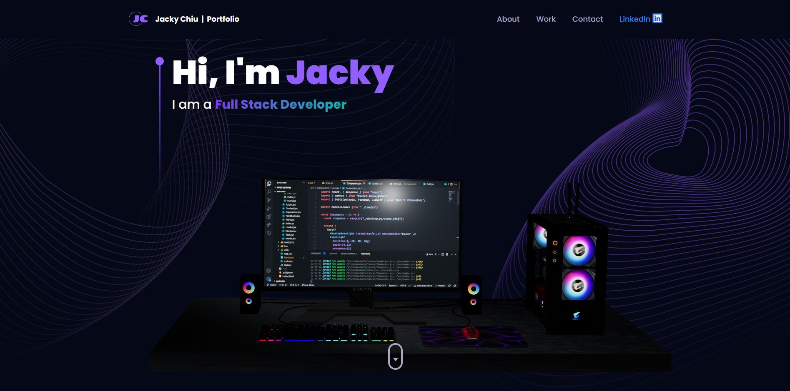
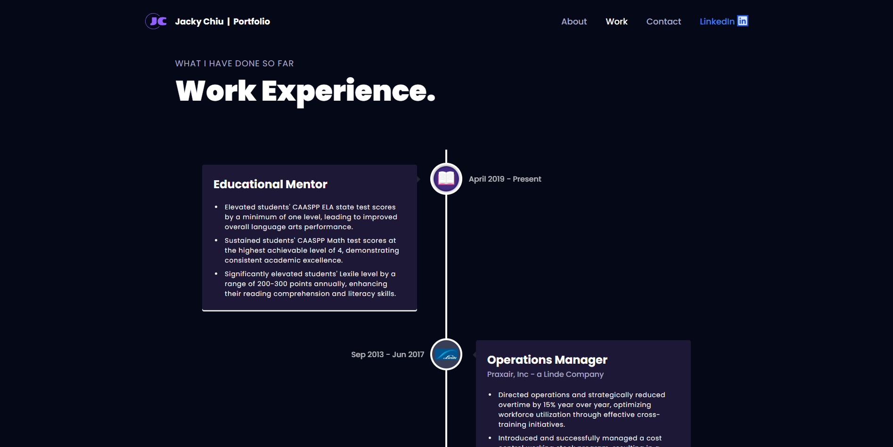
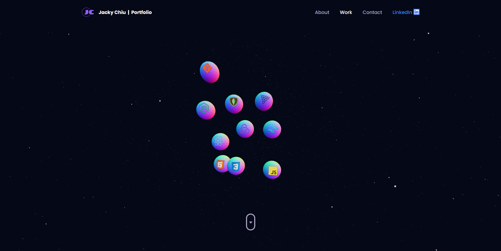
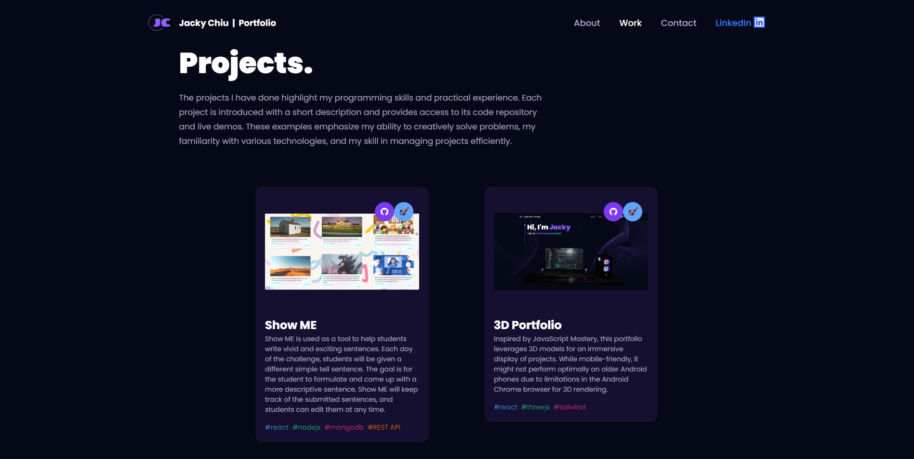
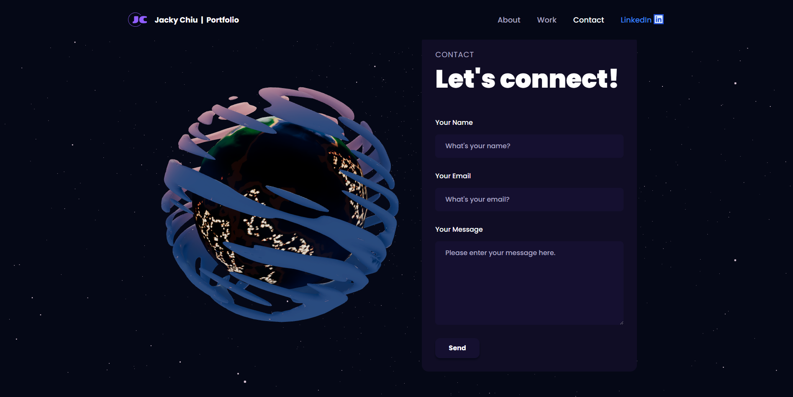

# 3D Portfolio

> Every developer needs a portfolio to display their work. This portfolio is inspired by JavaScript Mastery. It uses the power of 3D renderings to create a beautiful, interactive 3D portfolio that every developer can be proud of.

> Live website [_here_](https://3dportfoliopublic.netlify.app/).
>
> Inspired by JavaScript Mastery [_here_](https://www.youtube.com/watch?v=0fYi8SGA20k).

## Table of Contents

- [General Info](#general-information)
- [Technologies Used](#technologies-used)
- [Features](#features)
- [Screenshots](#screenshots)
- [Setup](#setup)
- [Project Status](#project-status)

## General Information

- As a developer, having an awesome portfolio is key to displaying one's awesome work. What better way to do this than to create a stunning 3D developer portfolio? Easily replace the information of the developer and get this portfolio up and running in no time at all. Note: Performance might decrease on older Andriod devices due to older browsers' limitations on 3D renderings.

## Technologies Used

- tailwindcss - version 3.3.3
- react - version 18.2.0
- @react-three/fiber - version 8.13.6
- @react-three/drei - version 9.80.3
- three - 0.155.0
- framer-motion - 10.15.2
- @emailjs/browser - 3.11.0

## Features

- Hero section displays an interactive 3D Desktop computer with VScode opened
- About section gives background information about yourself and your services
- Work Experience section displays a timeline of your work history
- Tech section displays the technologies you know about to use in a 3D space rendering
- Project section shows off projects you have done
- Testimonial section (optional) - display what people say about you or your work
- Contact section for people to reach you which uses emailjs

## Screenshots

## Setup

`cd to correct folder`

`npm install`

`npm run dev`

## Project Status

Project is: _completed_
